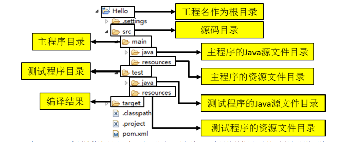
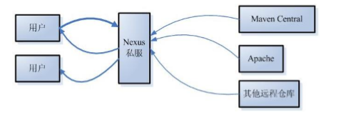

# Maven 核心概念

约定优于配置

Maven使用约定而不是配置，意味着开发者不需要自己创建构建过程

* POM
* 约定的目录结构
* 坐标
* 依赖管理
* 仓库管理
* 生命周期
* 插件和目标
* 继承
* 聚合

## POM

Project Object Model：项目对象模型。将 Java 工程的相关信息封装为对象作为便于操作和管理的模型。

Maven 工程的核心配置。可以说学习 Maven 就是学习 pom.xml 文件中的配置。

## 约定的目录结构

约定的目录结构对于 Maven 实现自动化构建而言是必不可少的一环，就拿自动编译来说，Maven 必须
能找到 Java 源文件，下一步才能编译，而编译之后也必须有一个准确的位置保持编译得到的字节码文件。

我们在开发中如果需要让第三方工具或框架知道我们自己创建的资源在哪，那么基本上就是两种方式：
* 通过配置的形式明确告诉它
* 基于第三方工具或框架的约定

Maven 对工程目录结构的要求就属于后面的一种。



## 坐标

使用如下三个向量在 Maven 的仓库中唯一的确定一个 Maven 工程。
* groupid：所属组
* artifactId：模块ID
* version：模块版本
* packaging 打包方式
  * jar（默认）
  * war web项目
  * pom 项目管理

```
<groupId>com.labi.interfaceSys</groupId>
<artifactId>interfaceSys</artifactId>
<version>1.3.0</version>
```

## 依赖管理

Maven 中最关键的部分，我们使用 Maven 最主要的就是使用它的依赖管理功能

**依赖的目的是什么**

当 A jar 包用到了 B jar 包中的某些类时，A 就对 B 产生了依赖，使用 dependency 标签指定被依赖 jar 包的坐标就可以了

```
<dependency>
  <groupId>com.labi.interfaceSys</groupId>
  <artifactId>interfaceSys</artifactId>
  <version>1.3.0</version>
</dependency>
```

**scope 依赖的范围**

* compile 默认
* test 测试依赖
* provided 开发依赖
* runtime 运行时
* system 需要显式提供包含依赖的jar，Maven不会在Repository中查找它

```
<dependency>
  <groupId>com.labi.interfaceSys</groupId>
  <artifactId>interfaceSys</artifactId>
  <version>1.3.0</version>
  <scope>compile</scope>
</dependency>
```

有效性总结

|       | compile | test | provided |
|-------|---------|------|----------|
|主程序  |    是   |   否  |    是    |
|测试程序|    是   |   是  |    是    |
|参与部署|    是   |   否  |    否    |


**依赖的传递性**

A 依赖 B，B 依赖 C，A 能否使用 C 呢？那要看 B 依赖 C 的范围是不是 compile，
如果是则可用，否则不可用。

**依赖的排除**

如果我们在当前工程中引入了一个依赖是 A，而 A 又依赖了 B，那么 Maven 会自动将 A 依赖的 B 引入当
前工程，但是个别情况下 B 有可能是一个不稳定版，或对当前工程有不良影响。这时我们可以在引入 A 的时
候将 B 排除。

```
<dependency>
  <groupId>com.9fbank.mcl</groupId>
  <artifactId>busserver</artifactId>
  <version>1.0.8</version>
  <exclusions>
    <exclusion>
      <groupId>*</groupId>
      <artifactId>*</artifactId>
    </exclusion>
  </exclusions>
</dependency>
```

**统一管理所依赖 jar 包的版本**

对同一个框架的一组 jar 包最好使用相同的版本。为了方便升级框架，可以将 jar 包的版本信息统一提
取出来

* 统一版本号

```
<properties>
  <interfaceSys.version>1.3.0</interfaceSys.version>
</properties>

<dependency>
  <groupId>com.labi.interfaceSys</groupId>
  <artifactId>interfaceSys</artifactId>
  <version>${interfaceSys.version}</version>
  <scope>compile</scope>
</dependency>
```

* 指定项目编码

```
<properties>
  <project.build.sourceEncoding>UTF-8</project.build.sourceEncoding>
</properties>
```


## 仓库

**分类**

* 本地仓库：为当前本机电脑上的所有 Maven 工程服务
* 远程仓库
  * 私服：架设在当前局域网环境下，为当前局域网范围内的所有 Maven 工程服务

  

  * 中央仓库：架设在 Internet 上，为全世界所有 Maven 工程服务。
  * 中央仓库的镜像：架设在各个大洲，为中央仓库分担流量。减轻中央仓库的压力，同时更快的响应用户请求。


**仓库中的文件**

* Maven 的插件
* 我们自己开发的项目的模块
* 第三方框架或工具的 jar 包


*`不管是什么样的 jar 包，在仓库中都是按照坐标生成目录结构，所以可以通过统一的方式查询或依赖。`*

## 生命周期

**什么是 Maven 的生命周期？**

Maven 生命周期定义了各个构建环节的执行顺序，有了这个清单，Maven 就可以自动化的执行构建命令了。

Maven 有三套相互独立的生命周期：
* Clean Lifecycle 在进行真正的构建之前进行一些清理工作；
* Default Lifecycle 构建的核心部分，编译，测试，打包，安装，部署等等；
* Site Lifecycle 生成项目报告，站点，发布站点。

它们是相互独立的，你可以仅仅调用 clean 来清理工作目录，仅仅调用 site 来生成站点。当然你也可以 直接运行 `mvn clean install site` 运行所有这三套生命周期。

每套生命周期都由一组阶段(Phase)组成，我们平时在命令行输入的命令总会对应于一个特定的阶段。比 如，运行 `mvn clean` ，这个 `clean` 是 Clean 生命周期的一个阶段。有 Clean 生命周期，也有 `clean` 阶段。


**Clean 生命周期**

Clean 生命周期一共包含了三个阶段：
* pre-clean 执行一些需要在 clean 之前完成的工作
* clean 移除所有上一次构建生成的文件
* post-clean 执行一些需要在 clean 之后立刻完成的工

**Site 生命周期**

* pre-site 执行一些需要在生成站点文档之前完成的工作
* site 生成项目的站点文档
* post-site 执行一些需要在生成站点文档之后完成的工作，并且为部署做准备
* site-deploy 将生成的站点文档部署到特定的服务器上

这里经常用到的是 `site` 阶段和 `site-deploy` 阶段，用以生成和发布 Maven 站点，
这可是 Maven 相当强大 的功能，Manager 比较喜欢，文档及统计数据自动生成，很好看。

**Default 生命周期**

Default 生命周期是 Maven 生命周期中最重要的一个，绝大部分工作都发生在这个生命周期中。这里， 只解释一些比较重要和常用的阶段：
* validate 验证工程是否正确，所有需要的资源是否可用
* generate-sources
* process-sources
* generate-resources
* process-resources 复制并处理资源文件，至目标目录，准备打包；
* compile 编译项目的源代码。
* process-classes
* generate-test-sources
* process-test-sources
* generate-test-resources
* process-test-resources 复制并处理资源文件，至目标测试目录；
* test-compile 编译测试源代码；
* process-test-classes
* test 使用合适的单元测试框架运行测试。这些测试代码不会被打包或部署；
* prepare-package
* package 接受编译好的代码，打包成可发布的格式，如 JAR；
* pre-integration-test
* integration-test
* post-integration-test
* verify
* install 将包安装至本地仓库，以让其它项目依赖；
* deploy 将最终的包复制到远程的仓库，以让其它开发人员与项目共享或部署到服务器上运行。

**生命周期与自动化构建**

*`运行任何一个阶段的时候，它前面的所有阶段都会被运行`*，例如我们运行 `mvn install` 的时候，
代码会 被编译，测试，打包。这就是 Maven 为什么能够自动执行构建过程的各个环节的原因。
此外，Maven 的插 件机制是完全依赖 Maven 的生命周期的，因此理解生命周期至关重要。

## 插件和目标

* Maven 的核心仅仅定义了抽象的生命周期，具体的任务都是交由插件完成的。
* 每个插件都能实现多个功能，每个功能就是一个插件目标。
* Maven 的生命周期与插件目标相互绑定，以完成某个具体的构建任务。

例如：`compile` 就是插件 `maven-compiler-plugin` 的一个目标；
`pre-clean` 是插件 `maven-clean-plugin` 的一个目标。

## 继承

**为什么需要继承机制？**

例如：由于非 compile 范围的依赖信息是不能在“依赖链”中传递的，所以有需要的工程只能单独配置

```
<dependency>
  <groupId>junit</groupId>
  <artifactId>junit</artifactId>
  <version>4.0</version>
  <scope>test</scope>
</dependency>
```

此时如果项目需要将各个模块的junit版本统一为4.9，那么到各个工程中手动修改无疑是非常不可取的。
使用继承机制就可以将这样的依赖信息统一提取到父工程模块中进行统一管理。

**创建父工程**

创建父工程和创建一般的 Java 工程操作一致，唯一需要注意的是：打包方式处要设置为 pom

```
<groupId>com.labi.common</groupId>
<artifactId>labi-parent</artifactId>
<version>1.0-SNAPSHOT</version>
<packaging>pom</packaging>
```

**在子工程中引用父工程**

```
<parent>
  <groupId>com.labi.common</groupId>
  <artifactId>labi-parent</artifactId>
  <version>1.0-SNAPSHOT</version>
  <!-- 指定从当前子工程的pom.xml文件出发，查找父工程的pom.xml的路径 -->
  <relativePath>../pom.xml</relativePath>
</parent>
```


**在父工程中管理依赖**

```
<dependencyManagement>
  <dependencies>
    <dependency>
      <groupId>junit</groupId>
      <artifactId>junit</artifactId>
      <version>4.9</version>
      <scope>test</scope>
    </dependency>
  </dependencies>
</dependencyManagement>
```

在子项目中重新指定需要的依赖，删除范围和版本号

```
<dependencies>
  <dependency>
    <groupId>junit</groupId>
    <artifactId>junit</artifactId>
  </dependency>
</dependencies>
```

## 聚合

**为什么要使用聚合？**

将多个工程拆分为模块后，需要手动逐个安装到仓库后依赖才能够生效。修改源码后也需要逐个手动进行 `clean` 操作。
而使用了聚合之后就可以批量进行 Maven 工程的安装、清理工作。

**如何配置聚合？**

在总的聚合工程中使用 modules/module 标签组合，指定模块工程的相对路径即可

```
<modules>
  <module>labi-common-base</module>
  <module>labi-common-config</module>
  <module>labi-common-core</module>
  <module>labi-common-web</module>
</modules>
```
